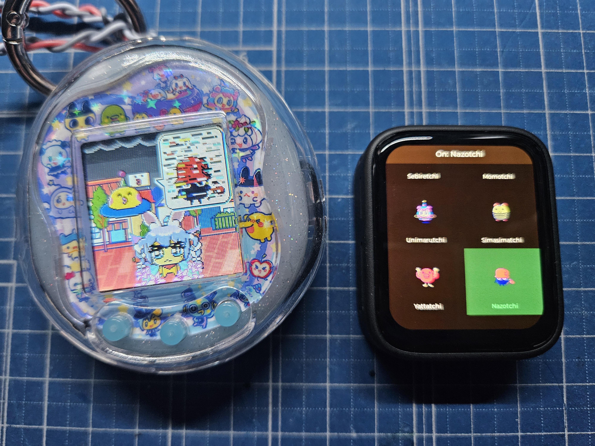

# Tamagotchi Uni Tama Search Helper




ESP32-S3 firmware that broadcasts [Tama Search](https://tamagotchi.fandom.com/wiki/Tamagotchi_Uni/Tama_Search_characters) Wi-Fi identities from a [Waveshare ESP32-S3-Touch-AMOLED-1.8](https://www.waveshare.com/esp32-s3-touch-amoled-1.8.htm). Tap a character on the AMOLED, then run Tama Search on a Tamagotchi Uni to meet that character.

This project is a personal hobby helper and is not affiliated with Bandai.

## Usage

1. Power the board and wait for the character grid.
2. Tap a character. The header shows `On: <name>` and the helper starts an open SoftAP.
3. On the Uni (child stage or later), press **C** in the living room and start Tama Search.
4. Tap the same character again to stop, or tap another character to switch.

Normal characters are selected by the last two bytes of the AP MAC address. Special characters need a matching SSID. The Uni only needs to see the beacon; it does not join the network.

Seasonal normal characters are labeled in the list, for example `Acchitchi (Summer)`. Special characters are grouped at the bottom.

## Hardware

- [Waveshare ESP32-S3-Touch-AMOLED-1.8](https://docs.waveshare.com/ESP32-S3-Touch-AMOLED-1.8) (original or V2)
- Tamagotchi Uni nearby, with Tama Search available

The board is a 1.8-inch 368×448 QSPI AMOLED with capacitive touch. This firmware uses the Waveshare BSP component `waveshare/esp32_s3_touch_amoled_1_8`.

## Build and flash

Requires [ESP-IDF](https://docs.espressif.com/projects/esp-idf/en/latest/esp32s3/get-started/index.html) 5.5 or later.

```bash
idf.py set-target esp32s3
idf.py build
idf.py -p COMx flash monitor
```

On Linux or macOS, use the serial device instead of `COMx` (for example `/dev/ttyACM0`). Exit the serial monitor with `Ctrl+]`.

The Wi-Fi channel defaults to 1. Change it with:

```bash
idf.py menuconfig
```

**Tama Search Helper → WiFi Channel**

`sdkconfig.defaults` already sets ESP32-S3, 16 MB flash, octal PSRAM, USB Serial/JTAG console, and a custom 8 MB app partition.

## Regenerating catalog assets

Character names, MAC bytes, SSIDs, and sprites are generated into `main/generated/`. The committed files are enough to build. To refresh them from the [wiki character tables](https://tamagotchi.fandom.com/wiki/Tamagotchi_Uni/Tama_Search_characters):

```bash
pip install pillow
python scripts/scrape_tama_wiki.py
```

Sprites are cached under `scripts/.cache/sprites/` and packed into `main/generated/tama_sprites.bin`. Rebuild after regenerating.

## How it works

The helper brings up a SoftAP with a locally administered MAC prefix `02:7A:6D:A0`.

| Section | Identity | SoftAP details |
| --- | --- | --- |
| Normal | Last two MAC bytes, as listed on the wiki | SSID `Hotspotchi` |
| Special | Exact event SSID from the wiki | MAC suffix `FF:FF` |

Touching a tile starts or stops that broadcast. The UI is LVGL 9 on the Waveshare BSP.

## Credits

- Character MAC/SSID tables and sprites: [Tamagotchi Wiki — Tama Search characters](https://tamagotchi.fandom.com/wiki/Tamagotchi_Uni/Tama_Search_characters)
- Board support: [Waveshare ESP32-S3-Touch-AMOLED-1.8](https://github.com/waveshareteam/ESP32-S3-Touch-AMOLED-1.8)
